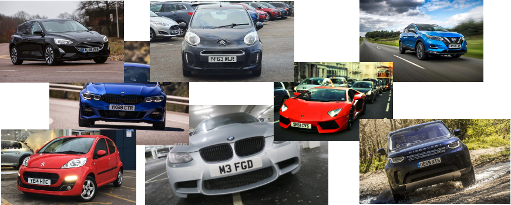

### Before we will start....
Before I will start talking about TensorFlow and Deep Learning let me give you disclaimer: I'm dumb sh*t. I'm no expert in Deep Learning or Tensorflow but I love exploring new areas where I have zero knowledge and TensorFlow was great opportunity. This is VERY complex topic so I feel little bit bad that I had to compress so much information in such a short post but maybe I will write more posts about ML/AI and TensorFlow in the future.

### What do we want to build?
- Car plate detection
- Car plate recognition
- Reading of car plate
- Sending data to a database

Why would I wanted to build this? I'm a member of the community called 'Cesko.Digital'. It is a group of (not only) IT experts voluntarily building tools for Czech government organisations but also watch the government how much transparent they are and how much they are spending in the IT. In January 2020 one of the teams has discovered that the cost for creating the highway vignettes e-shop will be 401M CZK and that there was no public tender for it. The community has decided for something which no one has done before. Cesko.Digital organised Hackathon where the community will build the portal over the weekend for free. And they did!

When I was thinking about it I was wondering would be possible to build for minimal cost camera system which will read the car plates and send the car plate details to the backend which will check whether the driver paid or not? Let's find out.

### What do we need?
We will want to run this on something small and relatively cheap. We will use Raspberry Pi with camera. To be able to build the car plate data set we will need A LOTS of pictures which I will explain later. In this case we will use data set with only around 300 pictures of cars with the UK car plates. Obviously I didn't go and start taking pictures of cars and car plates on the streets in London but luckily I have smart colleagues so they have scripted downloading car pictures from the internet. Thank you Darren!

When we have the data set we will need to build the data model from it. For these purposes we will need compute and in case of AI/ML we will need a lots of performance. My MacBook can't provide enough of compute power so I went to the internet and done some research. AWS and GCP has some pretty decent offerings however GCP looked like the most flexible one. Long story short (trust me finding the right GPU and find the best price/performance can be really long story) I recommend to use Tesla T4 GPU in GCP. More on this in other sections.

### Introduction into TensorFlow
TensorFlow has been developed by Google and you can 'see' TensorFlow being used in products like Search, Gmail, and Translate. Nowadays is being used widely by companies like Uber, Spotify or Tesla. TensorFlow can be used in many different scenarios: object detection (if we want to detect cars), text classification (reviewing sentiments of the comments) or face recognition. TensorFlow allows to run the data models on different devices so you can run them in cloud, on your VM or RaspberryPi - that's one of the big strengths of TensorFlow.

I will maybe go into the more details of TensorFlow in other posts but for now in case you want to study TensorFlow I would recommend Safari Books, YouTube or Coursera materials.

### TensorFlow vs TensorFlow Lite
TensorFlow has been around for many years but only quite recently (2 years) Google has announced TensorFlow Lite (TL). TL is optimised for the mobile/edge devices therefore ideal for our purposes and requirements. But are there any limitations?

Through the process of building models and testing I have found out there are few limitations. First one is the object detectors you can use. At this point TensorFlow Lite does NOT support RCNN models such as Faster-RCNN! It only supports SSD models. Second limitation which was a bit annoying is that TensorFlow is not optimized running on laptops. It runs great on the device like RasperryPi with ARP chipset but it will be really slow on your high-spec MacBook. TL libraries are just not optimised for x86 or x86_64 architecture so when you will be testing your scripts locally be aware of that.


### What is Dataset?
A wise (wo)man once said: Your neural network is only as good as the data you feed it. Our dataset is critical for this project therefore we will need solid dataset. As I have mentioned before I'm lucky and I have smart colleagues so I have managed to download around 300 pictures of cars with the UK car plates from the internet with their scripts. It is necessary to have pictures of different cars from different angles with different car UK plates which should be enough for now.

We will need dataset to learn the machine (computer, RaspberryPi) to recognise two objects - car and car plate. With the large sample of pictures we will be able to teach the computer how the car and car plate looks like. We will be able to teach the computer certain patterns based on which it will be recognising objects - cars and car plates.

There are multiple techniques how to improve your dataset. You can use various angles, scales, noise levels, picture qualities and object sizes to make it a bit harder for the computer to learn and train but in the end it will make your object recognition much more reliable. In this project I will not be using any of these techniques however this is something I will be probably write separate post.

Anyway back to our dataset. How does it look? These are some of the pictures I will be using:

&nbsp;



We have set of pictures and we will need to split them into two categories: train and test. After studying some of the articles I have split the pictures to 80:20 ratio. When we will start the training 80% of pictures will be used for training and 20% of pictures will be used for testing the dataset. What we will do is to create two directories in the folder with dataset and move the pictures into particular folders: test and train.

TensorFlow is very sensitive about size and format of pictures. I have found out hard way that if TensorFlow doesn't have the right inputs it will be unstable or it will be just hanging and doing nothing. For these purposes I have built the script which will go through your test or train folder (change the variable `folder`) and check if the pictures are in the right format.


```
import imghdr
import cv2
import os
import glob

for folder in ['test']:
    image_path = os.path.join(os.getcwd(), (folder))
print(image_path)
for file in glob.glob(image_path + '/*.jpg'):
    image = cv2.imread(file)
    file_type = imghdr.what(file)
if file_type != 'jpeg':
    print(file + " - invalid - " + str(file_type))
```

### Picture Annotation
Now the funny part! When we split pictures into two folder we will need to annotate all of them. Annotating pictures means that we will frame the objects which we are interested in EVERY picture. Yes this will take a while.

For these purposes I would recommend to use [labelImg](https://github.com/tzutalin/labelImg). I'm using MacOS so here are few simple steps to run it:
```
brew install python3
pip3 install pipenv
pipenv run pip install pyqt5==5.13.2 lxml
pipenv run make qt5py3
python3 labelImg.py
```
Now when you have it opened you need to open the whole folder with pictures and start annotating file by file.

&nbsp;


### Choosing an Object Detector
We have pictures which will be inputs, we have objects defined which we want to detect but we don't have the detector which will help to teach our data model those defined objects. Finding the right object detector (at least for me) was not that easy. You have to take in consideration multiple factors like what objects you will be detecting, where you will be running it, how fast the objects will need to be detected etc. This is huge topic and maybe I will talk about it little bit more in separate post but keep very long story short I will borrow the info from great post on [Medium](https://medium.com/@jonathan_hui/object-detection-speed-and-accuracy-comparison-faster-r-cnn-r-fcn-ssd-and-yolo-5425656ae359):

- SSD with MobileNet provides the best accuracy trade-off within the fastest detectors.

- SSD is fast but performs worse for small objects when compared to others.

- For large objects, SSD can outperform Faster R-CNN and R-FCN in accuracy with lighter and faster extractors.

Based on this I have decided for SSD Mobilenet V2.

### How to build a Data Model?
Alright, good stuff. We are finished with preparation and we can finally start to build Data Model. In my case I have decided for virtual machine running in GCP so we will need to get that machine ready. First of all let's create the VM.

#### Provisioning VM

In GCP you can go into Marketplace and launch Deep Learning VM which has pre-defined template with pre-installed TensorFlow.

Specs are below:

```
Machine type: n1-highmem-2 (2 vCPUs, 13 GB memory)
GPUs: 1 x NVIDIA Tesla T4
Zone: us-east1-d
framework: TensorFlow:1.15
```

As you can see I have chosen TensorFlow 1.15 and not 2.0. I didn't figure out why but TensorFlow 2.0 was very unstable for me so I downgraded to 1.15 which was much more stable. So now we have VM ready and we will upload dataset either via SCP or SFTP on the new VM.

#### Downloading TensorFlow Models and Object Detectors

After you will SSH to your VM (either via webbrowser or gcloud CLI) you will start with cloning TensorFlow Models repo:

`git clone https://github.com/tensorflow/models`

Open the folder, download and un-tar SSD TAR file:

```
cd research/object_detection/
wget http://download.tensorflow.org/models/object_detection/ssd_mobilenet_v2_quantized_300x300_coco_2019_01_03.tar.gz
tar xzvf ssd_mobilenet_v2_quantized_300x300_coco_2019_01_03.tar.gz
```

In `research/object_detection/` folder we will create folder `training` into which one we will copy SSD object detection config file:
```
mkdir training
cp samples/configs/ssd_mobilenet_v2_quantized_300x300_coco.config training/
```

Before we will go into the next step we will need to modify `/models/research/object_detection/training/ssd_mobilenet_v2_quantized_300x300_coco.config`:

Change `num_classes` accordingly based on how many objects we will need to detect. In our case it will be car plate only therefore 1:

```
model {
  ssd {
    num_classes: 1
    .....
      }
    }
```

I have changed `batch_size` to 6 as with larger batches TensorFlow can be a bit unstable:

```
train_config: {
  batch_size: 6
  optimizer {
```

Set the directory for checkpoint files:

```
fine_tune_checkpoint: "/home/matyasprokop/models/research/object_detection/ssd_mobilenet_v2_quantized_300x300_coco_2019_01_03/model.ckpt"
fine_tune_checkpoint_type:  "detection"
```

And the record inputs:

```
train_input_reader: {
  tf_record_input_reader {
    input_path: "/home/matyasprokop/models/research/object_detection/train.record"
  }
  label_map_path: "/home/matyasprokop/models/research/object_detection/training/labelmap.pbtxt"
}
```
```
eval_input_reader: {
  tf_record_input_reader {
    input_path: "/home/matyasprokop/models/research/object_detection/test.record"
  }
  label_map_path: "/home/matyasprokop/models/research/object_detection/training/labelmap.pbtxt"
  shuffle: false
  num_readers: 1
}
```


Building the data model will need Python libraries from TensorFlow models folder therefore we have to add them to PYTHONPATH:
```
export PYTHONPATH=/home/matyasprokop/models:/home/matyasprokop/models/research:/home/matyasprokop/models/research/slim
```

#### Compiling TensorFlow source
Even though we have TensorFlow installed we will need TensorFlow source. Download TensorFlow source from GitHub.

```
git clone https://github.com/tensorflow/tensorflow.git
cd tensorflow
```

Switch to the right branch. Please make sure you will switch to the same branch version as your TensorFlow installed.

```
git checkout r1.15
```

Now you just need to compile it which will take a while. Go and have a tea.

```
python ./configure.py
```

#### Generating records for the training
Now we need to translate the information we have about the pictures from XML to CSV. For these purposes we will use the script `xml_to_csv.py` from our repo.

```
python3 xml_to_csv.py
```

Before we will convert CSV into TensorFlow training records we will need to modify file `generate_tfrecord.py`. You will need to define all the labels which has been used for the object annotation. In my case I have annotated car plates with the label `plate`:

```
# TO-DO replace this with label map
def class_text_to_int(row_label):
    if row_label == 'plate':
        return 1
    else:
        None
```

We are ready now and we can convert CSVs into TensorFlow training records:
```
python3 generate_tfrecord.py --csv_input=images/train_labels.csv --image_dir=images/train --output_path=train.record
python3 generate_tfrecord.py --csv_input=images/test_labels.csv --image_dir=images/test --output_path=test.record
```

Awesome. Almost there! Last thing we have to do before we will start the training of our brand new data model will be label map. You will need to define it in `/models/research/object_detection/training/labelmap.pbtxt` and it will look in our case like this:

```
item {
  id: 1
  name: 'plate'
}
```

#### Building the data model
Finally you have all set and ready and now the last step before we will start the training of our model we will run protoc to compile .proto files from TensorFlow Object Detection APIs to Python:

```
protoc --python_out=. ./object_detection/protos/anchor_generator.proto ./object_detection/protos/argmax_matcher.proto ./object_detection/protos/bipartite_matcher.proto ./object_detection/protos/box_coder.proto ./object_detection/protos/box_predictor.proto ./object_detection/protos/eval.proto ./object_detection/protos/faster_rcnn.proto ./object_detection/protos/faster_rcnn_box_coder.proto ./object_detection/protos/grid_anchor_generator.proto ./object_detection/protos/hyperparams.proto ./object_detection/protos/image_resizer.proto ./object_detection/protos/input_reader.proto ./object_detection/protos/losses.proto ./object_detection/protos/matcher.proto ./object_detection/protos/mean_stddev_box_coder.proto ./object_detection/protos/model.proto ./object_detection/protos/optimizer.proto ./object_detection/protos/pipeline.proto ./object_detection/protos/post_processing.proto ./object_detection/protos/preprocessor.proto ./object_detection/protos/region_similarity_calculator.proto ./object_detection/protos/square_box_coder.proto ./object_detection/protos/ssd.proto ./object_detection/protos/ssd_anchor_generator.proto ./object_detection/protos/string_int_label_map.proto ./object_detection/protos/train.proto ./object_detection/protos/keypoint_box_coder.proto ./object_detection/protos/multiscale_anchor_generator.proto ./object_detection/protos/graph_rewriter.proto ./object_detection/protos/calibration.proto ./object_detection/protos/flexible_grid_anchor_generator.proto
```

Before we will start training the model please set env variables which we will use in next few scripts:

```
export CONFIG_FILE=/home/matyasprokop/models/research/object_detection/training/ssd_mobilenet_v2_quantized_300x300_coco.config
export CHECKPOINT_PATH=/home/matyasprokop/models/research/object_detection/training/model.ckpt-28171
export OUTPUT_DIR=/home/matyasprokop/models/research/object_detection/TFLite_model
```

When this is done we will run the command to start training of our model:
```
python3 train.py --logtostderr --train_dir=training/ --pipeline_config_path=$CONFIG_FILE
```


&nbsp;


Now have a coffee, dinner, shower, go to bed and when you will wake up in the morning your model should be finished. You want to get with the loss consistently below 2 which will take a while. This will take approximately 8 hours.

#### Converting TensorFlow data model to TensorFlow Lite data model
Did you have a good sleep? Almost there! Now when we have TensorFlow model done we need to convert it to TensorFlow Lite model. This is pretty easy. We will use script from `models/research/object_detection`

```
python3 export_tflite_ssd_graph.py --pipeline_config_path=$CONFIG_FILE --trained_checkpoint_prefix=$CHECKPOINT_PATH --output_directory=$OUTPUT_DIR --add_postprocessing_op=true
```

#### Wrapping it all up
Now we need to wrap everything together and we will us Bazel for it. Make sure you will use the right version of Bazel. TensorFlow 1.15 only support bazel version 0.21.0 or lower so please be aware of that.

```
cd ~/tensorflow
bazel run -c opt tensorflow/lite/toco:toco -- --input_file=$OUTPUT_DIR/tflite_graph.pb --output_file=$OUTPUT_DIR/detect.tflite --input_shapes=1,300,300,3 --input_arrays=normalized_input_image_tensor --output_arrays=TFLite_Detection_PostProcess,TFLite_Detection_PostProcess:1,TFLite_Detection_PostProcess:2,TFLite_Detection_PostProcess:3 --inference_type=QUANTIZED_UINT8 --mean_values=128 --std_values=128 --change_concat_input_ranges=false --allow_custom_ops
```

Finished? Looks like we are there:) Now if you go to `TFLite_model` folder you will see `detect.tflite` file. This is what we will need to download and upload to our RaspberryPi. In the same folder create new file called `labelmap.txt` and list all the labels we have used. In this case it will "plate". Download `labelmap.txt` as well.

```
plate
```

### Running our TensorFlow Lite model
Data model is now finished and we can use it for detecting car plates. We will use RaspberryPi with the video camera. For testing purposes I was using script to detect object in the video. It is generic script which will run the video (in my case it is video recorded on my iPhone) and using data model on top of it which we have just created.

#### Car Plate Detection
Let's start will cloning my repo on your RaspberryPi.

```
git clone https://git.matyasprokop.com/mprokop/plate-recognition
cd plate-recognition
```


For testing the data model with the video use the script `TFLite_detection_video.py`. Create new folder called `tflite_graphs/plates` and copy `detect.tflite` and `labelmap.txt` to the folder. Run the script with parameter
`--modeldir=tflite_graphs/plates` which will apply our model from the directory `tflite_graphs/plates`.

```
python3 TFLite_detection_video.py --modeldir=tflite_graphs/plates
```

When we run the script we should see something like this:

&nbsp;


#### Car Plate Recognition
This was fun and we can now recognise car plates which is a great start and it proves that our data model works. Next step will be to crop recognised car plate and run OCR on top of it. For these purposes we will use OpenCV and pytesseract libraries.

We will use another script called `TFLite_reco_video.py`.

OpenCV will allow to crop the car plate from the frame and pytesseract will do the OCR recognition.

We will crop the image from the frame:
```
crop_img = frame[ymin-10:ymax-10, xmin-10:xmax-10]
```

Now when we have car plate cropped and ready for OCR we want to make the letters readable as much as we can. And that showed as the biggest challenge in my project. Car plates are usually taken from different angles and they have different sizes which is not really challenging for TensorFlow to detect car plates but it is very challenging for OCR to read the car plates. The best combination I have found (and I'm sure there is still huge opportunity for improvement) is to make grey picture and reduce the noise.
```
gray = cv2.cvtColor(crop_img, cv2.COLOR_BGR2GRAY)
thresh = cv2.GaussianBlur(gray, (3,3), 0)
```

When we have car plate picture `thresh` we will OCR the car plate and read the meta data.
```
meta = pytesseract.image_to_data(Image.open(filename), lang='gb', output_type=pytesseract.Output.DICT)
```

Next will be OCR of car plate. To make OCR as much accurate as we can we will use pre-trained data for UK Car plate font which will be stored in `tessdata` folder:
```
text_string = pytesseract.image_to_string(Image.open(filename),lang='gb')
```

To minimize any 'false alarms' we will need to get from pytesseract the confidence level:
```
confidence = int(meta['conf'][len(text)-1])
```

Now when we have confidence level we can start detecting car plates and playing with level of the confidence. I have found that best level is about 73 so if the car plate text is not empty and the confidence level is above 73 the car plate string is showed in the terminal and picture of car plate with the car plate string in the title.

```
if (text_string != "") and confidence > 73 and len(text_string)>6:
    print("ID:" + str(text_string) + " Confidence:" + str(confidence))
    label = '%s: %d%%' % (str(text_string), confidence) # Example: 'person: 72%'
    labelSize, baseLine = cv2.getTextSize(label, cv2.FONT_HERSHEY_SIMPLEX, 0.7, 2) # Get font size
    label_ymin = max(ymin, labelSize[1] + 10) # Make sure not to draw label too close to top of window
    cv2.rectangle(frame, (xmin, label_ymin-labelSize[1]-10), (xmin+labelSize[0], label_ymin+baseLine-10), (255, 255, 255), cv2.FILLED) # Draw white box to put label text in
    cv2.putText(frame, "ID:" + str(text_string), (xmin, label_ymin-7), cv2.FONT_HERSHEY_SIMPLEX, 0.7, (0, 0, 0), 2) # Draw label text
    cv2.imshow(str(text_string), thresh)
```
We will use the same data model in the same folder however we will use different script.
```
python3 TFLite_reco_video.py --modeldir=tflite_graphs/plates
```

On the video it looks something like this:


&nbsp;


### Real time Recognition
In case you want to do this real-time and run the car plate recognition on your RaspberryPi or any other device with the camera use the script `TFLite_detection_webcam.py`.
```
python3 TFLite_detection_webcam.py --modeldir=tflite_graphs/plates
```

### What can be improved in the future?
Will this be able to replace expensive solutions which are already used on Czech highways? Almost certainly not. I think the biggest weakness appeared to be camera resolution which in case of RasppberyPi is not great. Even though I was recording video on iPhone it still wasn't very good mainly because of the optics and zoom ability. I can imagine statically mounted proper high resolution camera which will be pointing to the same area all the time will be much better.

Performance wise I think TensorFlow Lite showed that this is doable on RaspberryPi. It was able to detect car plates in the realtime. The weakest point of this was the performance of OCR. OCR is super sensitive on light, quality, angels and noise. Huge improvement would be probably to use TensorFlow for OCR which I will look in the future.

Overall this was really funny project and for me personally great introduction into AI/ML. I'm already thinking how to use this into networking!


### Sources
[https://git.matyasprokop.com/mprokop/plate-recognition](https://git.matyasprokop.com/mprokop/plate-recognition)<br>
[https://learning.oreilly.com/library/view/learning-tensorflow/9781491978504/](https://learning.oreilly.com/library/view/learning-tensorflow/9781491978504/)<br>
[https://learning.oreilly.com/library/view/tensorflow-for-deep/9781491980446/](https://learning.oreilly.com/library/view/tensorflow-for-deep/9781491980446/)<br>
[https://github.com/mahavird/my_deep_anpr](https://github.com/mahavird/my_deep_anpr)<br>
[https://github.com/GuiltyNeuron/ANPR](https://github.com/GuiltyNeuron/ANPR)<br>
[https://github.com/EdjeElectronics/TensorFlow-Lite-Object-Detection-on-Android-and-Raspberry-Pi/blob/master/Raspberry_Pi_Guide.md](https://github.com/EdjeElectronics/TensorFlow-Lite-Object-Detection-on-Android-and-Raspberry-Pi/blob/master/Raspberry_Pi_Guide.md)<br>
[https://circuitdigest.com/microcontroller-projects/license-plate-recognition-using-raspberry-pi-and-opencv](https://circuitdigest.com/microcontroller-projects/license-plate-recognition-using-raspberry-pi-and-opencv)<br>
[https://www.youtube.com/watch?v=TiOKvOrYNII](https://www.youtube.com/watch?v=TiOKvOrYNII)<br>
[https://egallen.com/red-hat-codeready-containers-gpu/](https://egallen.com/red-hat-codeready-containers-gpu/)<br>
[https://www.youtube.com/watch?time_continue=5&v=V4P_ptn2FF4&feature=emb_title](https://www.youtube.com/watch?time_continue=5&v=V4P_ptn2FF4&feature=emb_title)<br>
[http://matthewearl.github.io/2016/05/06/cnn-anpr/](http://matthewearl.github.io/2016/05/06/cnn-anpr/)<br>
